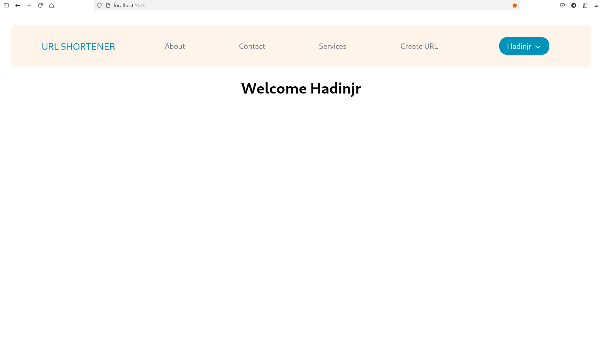
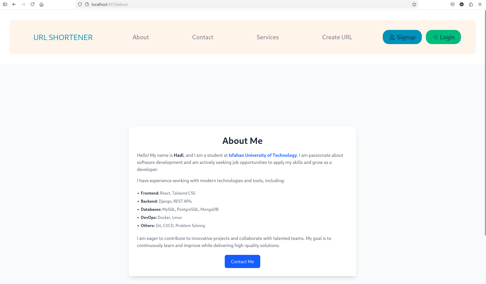
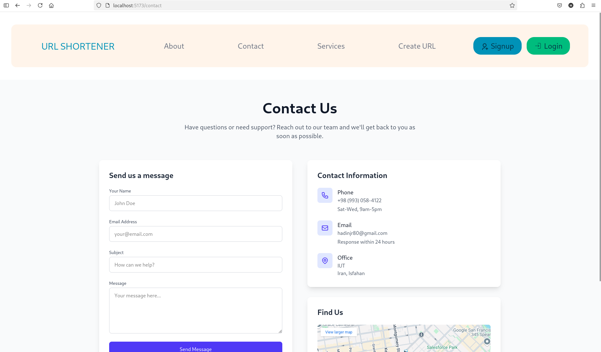
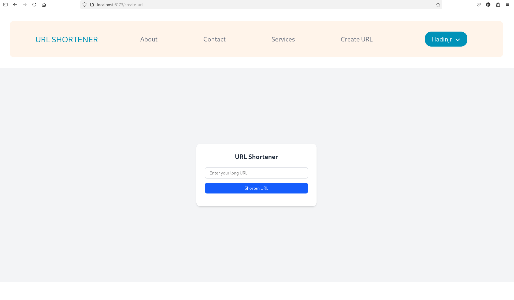
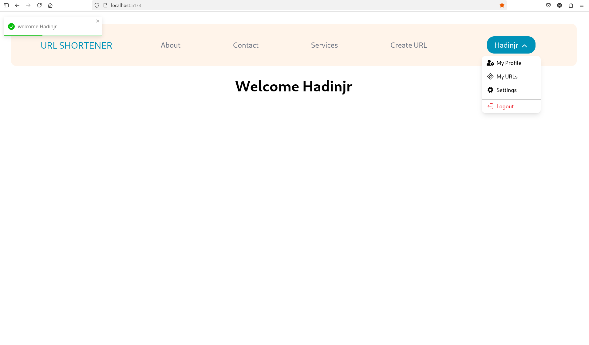
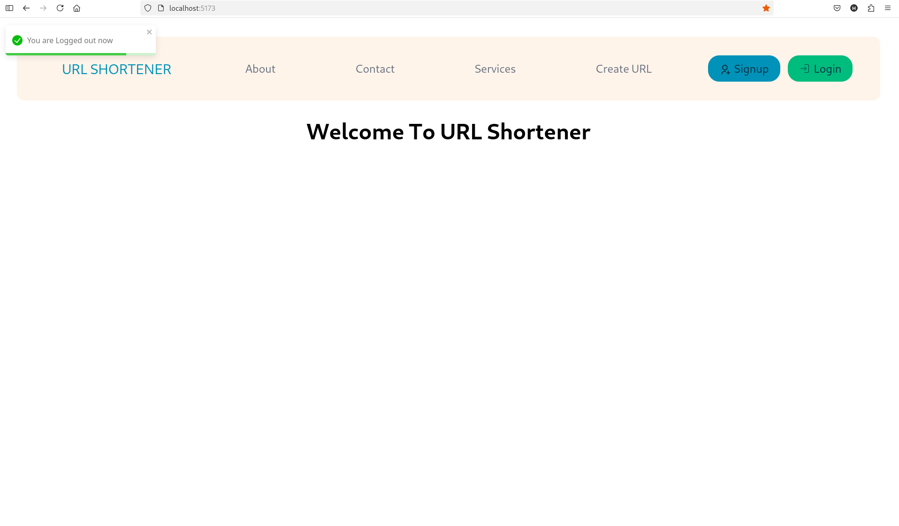
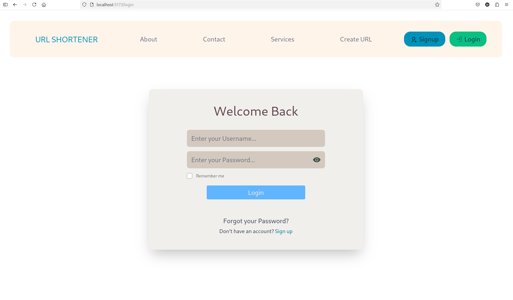
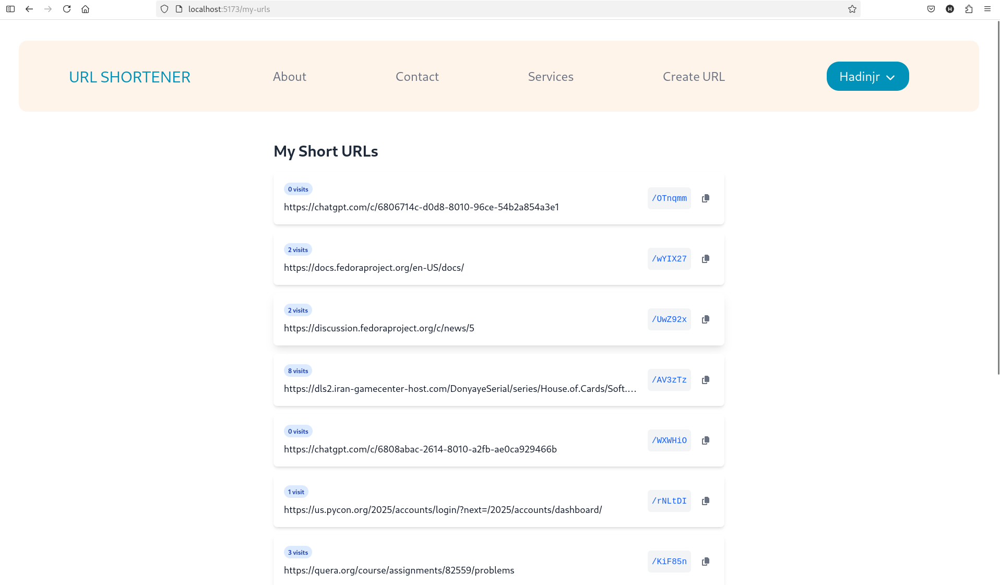
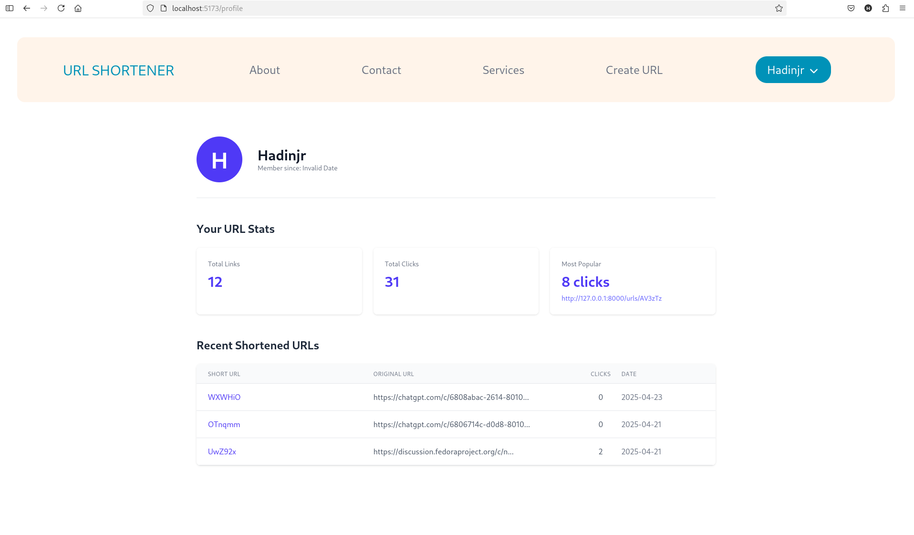
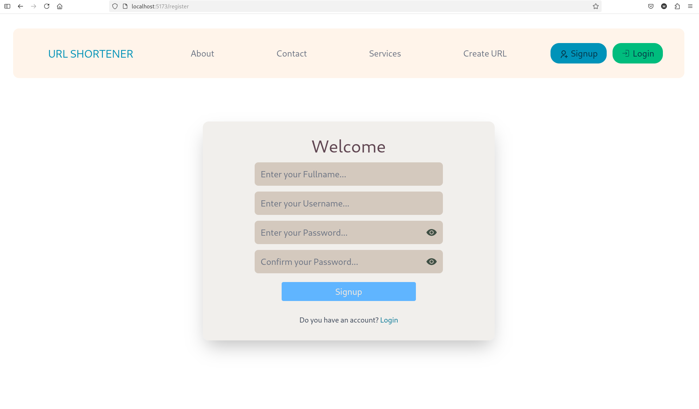

# 🔗 URL Shortener

A full-stack, production-ready URL shortener built with Django, React, PostgreSQL, Redis, Celery, and Docker.

## 📸 Screenshots

<p align="center">
  
  
</p>
<p align="center">
  
  
</p>
<p align="center">
  
  
</p>
<p align="center">
  
  
</p>
<p align="center">
  
  
</p>


## 🚀 Features

- 🔐 Secure authentication using **JWT Cookie-based Authentication**
- 👤 User registration, login, logout with session persistence
- ✂️ URL shortening with user-specific dashboards
- 📊 Manage and view all your shortened URLs
- 🧠 Asynchronous tasks (e.g., processing or analytics) with Celery + Redis
- 🐳 Fully Dockerized for easy local development
- ⚛️ Modern React frontend using Vite and Context API

## 🔐 Authentication

This project uses **JWT Authentication with HTTP-only cookies**, implemented via Django REST Framework and custom logic. This approach ensures:

- Secure storage (unlike localStorage)
- CSRF protection included
- Frontend-friendly session management

Authentication logic can be found in:

- `backend/accounts/auth_handler.py`
- `frontend/src/auth/*`


## 🛠 Tech Stack

- **Frontend**: React + Vite
- **Backend**: Django + Django Rest Framework
- **Database**: PostgreSQL
- **Task Queue**: Celery + Redis
- **Containerization**: Docker + Docker Compose

## 🧾 Project Structure
```bash
├── backend
│   ├── accounts
│   │   ├── admin.py
│   │   ├── apps.py
│   │   ├── auth_handler.py
│   │   ├── forms.py
│   │   ├── __init__.py
│   │   ├── models.py
│   │   ├── serializers.py
│   │   ├── tests.py
│   │   ├── urls.py
│   │   └── views.py
│   ├── celerybeat-schedule
│   ├── Dockerfile
│   ├── manage.py
│   ├── requirements.txt
│   ├── url
│   │   ├── asgi.py
│   │   ├── celery.py
│   │   ├── __init__.py
│   │   ├── settings.py
│   │   ├── urls.py
│   │   └── wsgi.py
│   └── urls
│       ├── admin.py
│       ├── apps.py
│       ├── __init__.py
│       ├── models.py
│       ├── serializers.py
│       ├── tasks.py
│       ├── tests.py
│       ├── urls.py
│       └── views.py
├── docker-compose.yml
├── frontend
│   ├── Dockerfile
│   ├── eslint.config.js
│   ├── index.html
│   ├── package.json
│   ├── package-lock.json
│   ├── public
│   │   └── vite.svg
│   ├── README.md
│   ├── src
│   │   ├── App.jsx
│   │   ├── auth
│   │   │   ├── api.js
│   │   │   ├── AuthContext.jsx
│   │   │   ├── CheckAuth.js
│   │   │   ├── CheckUsername.js
│   │   │   ├── create_request.js
│   │   │   ├── csrf.js
│   │   │   ├── GetCSRF.js
│   │   │   ├── Login.js
│   │   │   ├── Logout.js
│   │   │   └── Signup.js
│   │   ├── components
│   │   │   ├── ClickOutside.jsx
│   │   │   ├── Logout.jsx
│   │   │   └── Navbar.jsx
│   │   ├── main.jsx
│   │   ├── pages
│   │   │   ├── About.jsx
│   │   │   ├── Contact.jsx
│   │   │   ├── CreateUrl.jsx
│   │   │   ├── Home.jsx
│   │   │   ├── LoginPage.jsx
│   │   │   ├── MyURLs.jsx
│   │   │   ├── Profile.jsx
│   │   │   ├── Services.jsx
│   │   │   └── SignupPage.jsx
│   │   ├── routes
│   │   │   ├── PrivateRoute.jsx
│   │   │   └── PublicRoute.jsx
│   │   ├── styles.css
│   │   └── urls
│   │       ├── api.js
│   │       ├── CreateURL.js
│   │       ├── GetResult.js
│   │       └── GetURLs.js
│   └── vite.config.js
└── README.md
```

## 🐳 Getting Started (with Docker)

```bash
# Clone the repo
git clone https://github.com/xadla/Url-Shortener.git
cd Url-Shortener

# Build and start all services
docker-compose up --build
```
- The frontend will be available at: http://localhost:5173
- The backend API will run at: http://localhost:8000

Make sure Docker and Docker Compose are installed on your machine.
## 🛠 For Development

If you prefer to run the project without Docker, follow these steps:

### 📦 Backend (Django)

```bash
# Go to backend folder
cd backend

# Create a Virtual Environment
python -m venv venv
source venv/bin/activate   # On Windows: venv\Scripts\activate

# Install dependencies
pip install -r requirements.txt

# Run database migrations
python manage.py migrate

# Run the development server
python manage.py runserver
```
### ⚛️ Frontend (React)
```bash
# Go to frontend folder
cd frontend

# Install dependencies
npm install

# Start the development server
npm run dev

# The app will be available at http://localhost:5173
```
### 🧠 Celery (for create URL async)
```bash
# Run Redis server (if not using Docker, install Redis locally)
redis-server

# Start Celery worker (run this from backend directory)
celery -A url worker --loglevel=info
```

## 📦 API Endpoints
Example API routes:
- POST /auth/register/
- POST /auth/login/
- GET /auth/check/

## 🤝 Contributing
Pull requests are welcome. For major changes, please open an issue first to discuss what you’d like to change.
## 🧑‍💻 Author
- GitHub: @xadla